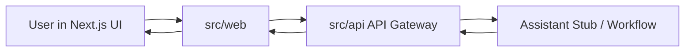
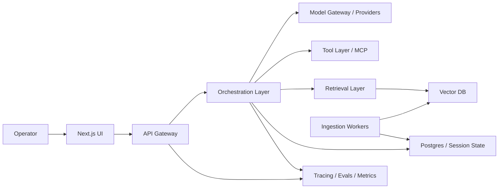

# Architecture V1

## Goal

Define the first honest architecture for Team AI based on the current repo, not an imagined final state.

## Current State

The repo already contains a working thin slice:

- [src/web/src/app/page.tsx](/Users/pawan/Vizmo/team-ai/src/web/src/app/page.tsx)
  - fetches `/api/health`
- [src/api/src/index.ts](/Users/pawan/Vizmo/team-ai/src/api/src/index.ts)
  - serves `/health`
- shared types in `src/packages/types`

This is enough to treat Week 1 as an extension of a live path rather than greenfield scaffolding.

## Week 1 Target Architecture

At the end of Week 1, the system should support:

- a user question from the UI
- a typed request to the API
- a structured assistant response
- room in the response schema for citations and plan steps

## 60-Day Target Architecture

## Core Architecture Decisions

### 1. Keep the Web App Thin

`src/web` should focus on:

- input and output
- session display
- metrics and review surfaces

It should not own orchestration logic.

### 2. Treat `src/api` As The Gateway

`src/api` should own:

- request validation
- auth later
- orchestration endpoints
- streaming later
- trace correlation

### 3. Start With One Workflow

The first real assistant should be a single workflow with structured outputs.
Do not start with multiple agents.

### 4. Add Citations Early

Even before full retrieval lands, the response schema should anticipate:

- `answer`
- `citations`
- `plan_steps`
- `confidence` or `notes`

### 5. Separate State From Knowledge

When retrieval and memory arrive:

- session state belongs in Postgres or Redis
- durable knowledge belongs in source docs plus vector indexes
- traces belong in observability tooling

## Suggested Contracts For Week 1

Add these shared types soon:

- `AssistantRequest`
  - `query`
  - `sessionId`
  - `mode`
- `AssistantResponse`
  - `answer`
  - `citations`
  - `planSteps`
  - `meta`
- `Citation`
  - `source`
  - `label`
  - `snippet`

## Immediate Next Step

Add a new typed assistant endpoint in `src/api`, then connect a basic input form in `src/web` to exercise the full path.

## Open Questions

- Will the first assistant mode be pure Q&A, plan generation, or both?
- Should the initial workflow be sync only, with streaming added in Week 2?
- Should the first corpus come from repo docs, markdown notes, or both?
